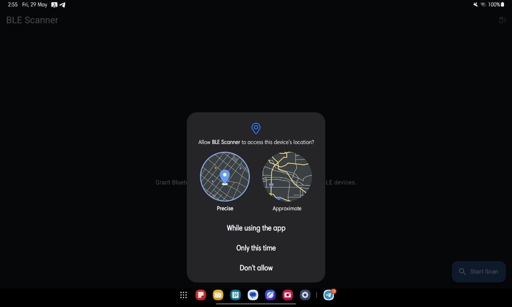
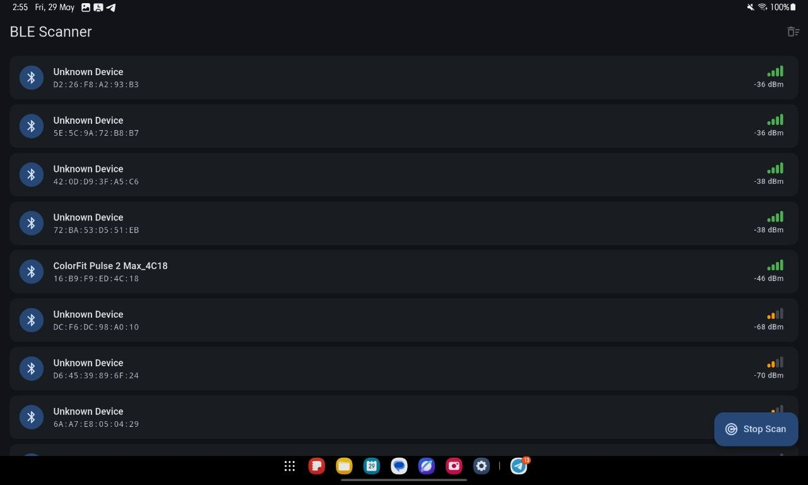
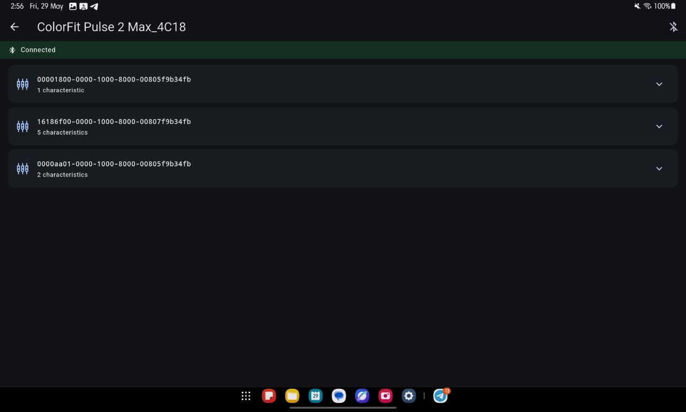
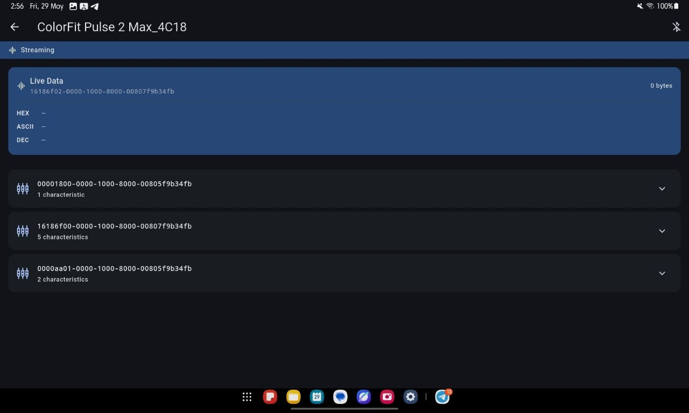
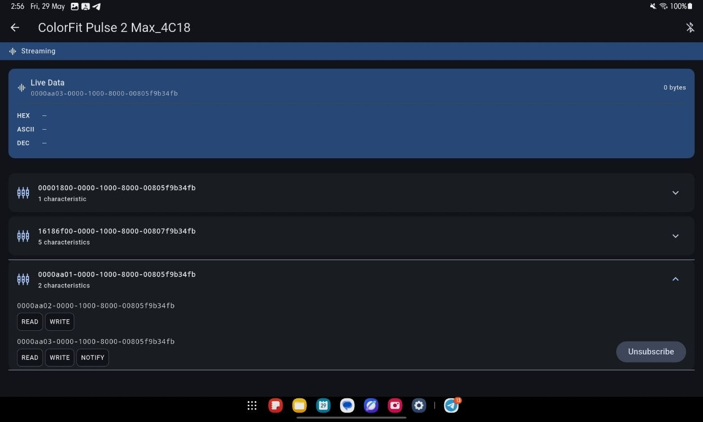

# BLE Scanner

A Flutter app that discovers nearby BLE devices, connects to a selected device, browses its GATT services, and streams live characteristic data — decoded as HEX, ASCII, and decimal in real time.

Built with `flutter_reactive_ble`, BLoC, `go_router`, and `flutter_hooks` on a clean feature-first architecture.

---

## Screenshots











---

## Requirements

- Flutter 3.24+ / Dart 3.4+
- Android 10+ (API 29+) — physical device or emulator with BLE support
- iOS: Xcode 15+, physical device (BLE unavailable on simulator)

## Setup

```bash
git clone <repo>
cd ble_scanner
flutter pub get
flutter run
```

Release APK:

```bash
flutter build apk --release
# Output: build/app/outputs/flutter-apk/app-release.apk
```

## Permissions

Requested at runtime — manifest declares all three; the OS ignores unknown permissions on older API levels.

| Android Version | Permissions Required |
|---|---|
| < 12 (API < 31) | `ACCESS_FINE_LOCATION` |
| 12+ (API 31+) | `BLUETOOTH_SCAN`, `BLUETOOTH_CONNECT` |

> **Note:** Android BLE scan requires location permission on API < 31. This is a counterintuitive OS requirement — not an app design choice.

---

## Architecture

### Folder Structure

```
lib/
  core/
    ble/ble_repository.dart     # Single BLE abstraction over FlutterReactiveBle
    permissions/                # Runtime permission wrapper
    router/                     # go_router config
    theme/                      # Material 3 theme
  features/
    scanner/                    # Scan feature (self-contained)
      bloc/                     # ScannerBloc + events + states
      models/                   # ScannedDevice
      view/                     # ScannerScreen + widgets
    device_detail/              # Device detail feature
      bloc/                     # DeviceBloc + events + states
      view/                     # DeviceDetailScreen + widgets
  app.dart                      # Root HookWidget
  main.dart                     # Entry point + providers
```

### State Management

**BLoC** handles all async state. No state lives in widgets — widgets dispatch events and render states.

- **`ScannerBloc`** — manages the `FlutterReactiveBle` scan stream subscription; deduplicates discovered devices by ID; sorts by RSSI descending.
- **`DeviceBloc`** — manages the connection stream and characteristic subscription. One active subscription at a time — subscribing to a new characteristic cancels the previous.

### Data Flow

```
BleRepository
    ↓ Stream<DiscoveredDevice>
ScannerBloc → ScannerState → ScannerScreen → DeviceTile
                                    ↓ (tap)
                              GoRouter.push('/device/:id', extra: device)
                                    ↓
DeviceBloc → DeviceState → DeviceDetailScreen
              ↓
    ConnectionStateUpdate → discoverServices()
              ↓
    DeviceConnected(services) → ServiceExpansionTile
              ↓ (subscribe)
    Stream<List<int>> → DeviceStreaming(latestValue) → LiveDataCard
```

### HookWidget Pattern

Every widget uses `HookWidget` (from `flutter_hooks`). Side effects use `useEffect`, local UI state uses `useState`, expensive objects use `useMemoized`.

- `ScanFab` — uses `useAnimationController` + `useEffect` to run/stop its rotation animation based on scan state. No `AnimationController` disposal code needed.
- `DeviceDetailScreen` — uses `useEffect` returning a cleanup that dispatches `DisconnectDevice` when the screen is popped. Guarantees cleanup even on back-swipe.

### Navigation

`go_router` with type-safe `extra` parameter for passing `ScannedDevice` to the detail route. Each route creates its BLoC via `BlocProvider` — BLoC lifetime is tied to the route, not the app.

`state.extra` is typed as `Object?` and requires a cast (`state.extra! as ScannedDevice`) at the route boundary. This is safe because only the in-app push sets the extra value.

### Private BLoC Events

Both `ScannerBloc` and `DeviceBloc` use internal events (`_DeviceDiscovered`, `_ConnectionStateUpdated`, etc.) prefixed with `_` to prevent external code from dispatching them. Because `_`-prefixed names are library-private and sealed class subclasses must live in the same library, the `part`/`part of` pattern is used. This is the intended Dart language feature, not a workaround.

---

## BLE Integration

All BLE operations go through `BleRepository`, which wraps `FlutterReactiveBle`:

```dart
// Scanning
repository.scanForDevices()            // Stream<DiscoveredDevice>

// Connecting
repository.connectToDevice(id)         // Stream<ConnectionStateUpdate>

// Discovering services
repository.discoverServices(id)        // Future<List<DiscoveredService>>

// Subscribing to a characteristic
repository.subscribeToCharacteristic(
  deviceId: id,
  serviceId: serviceUuid,
  characteristicId: charUuid,
)                                      // Stream<List<int>>
```

**There is no explicit disconnect method.** Cancelling the `connectToDevice` stream subscription triggers BLE disconnection. `DeviceBloc` cancels `_connectionSubscription` in `_onDisconnect` and `close()`.

### Key BLE Behaviors

- **Connection is a stream, not a future.** You cannot `await connect()` — you must listen for `DeviceConnectionState.connected` before calling `discoverServices`. Every lifecycle transition must be explicitly handled.
- **Service discovery has latency.** After `connected`, `discoverServices` can take 200ms–2s depending on device and service count. A loading state during this window is required.
- **Characteristic properties must be checked.** Not all characteristics are notifiable. `isNotifiable || isIndicatable` is checked before showing the subscribe button — prevents runtime errors from the BLE stack.
- **RSSI is noisy.** Stationary devices show ±5 dBm variation between scan events. Sorted descending by RSSI as a proximity approximation; the list reorders frequently.
- **Some devices stop advertising after first connection** — the scanner won't re-discover them until they explicitly restart advertising.
- **Large values may be silently truncated** on older devices unless MTU is explicitly requested. `flutter_reactive_ble` handles MTU negotiation internally but does not auto-request larger MTU.

### Post-Await State Guards

Any `await` inside a BLoC event handler creates a window where another event can change state. After `await _repository.discoverServices(...)`, the guard:

```dart
if (state is DeviceDisconnected) return;
```

prevents emitting `DeviceConnected` for a device that dropped during discovery. These guards are non-negotiable in async BLoC handlers.

---

## Design Decisions

### `flutter_reactive_ble` only

The reactive stream API maps naturally to BLoC — scan produces `Stream<DiscoveredDevice>`, connection produces `Stream<ConnectionStateUpdate>`, subscribe produces `Stream<List<int>>`. All BLE ops are wrapped in `BleRepository` to decouple features from the library.

### BLoC over Riverpod/Provider

BLoC's explicit event→state contract makes the async BLE state machine traceable. Connecting, discovering, streaming, and error states are all distinct typed classes — impossible to confuse.

### Single `BleRepository` singleton

`FlutterReactiveBle` internally manages a BLE adapter connection. Multiple instances cause undefined behavior. One instance is provided at the root via `RepositoryProvider` and injected into each BLoC at route creation time.

### `HookWidget` everywhere

Eliminates `StatefulWidget` boilerplate. `useEffect` handles subscriptions and side effects (including screen-level cleanup like disconnect on pop), `useMemoized` handles expensive object creation (GoRouter), and `useAnimationController` removes all manual controller disposal.

### Service discovery after `connected` event

`flutter_reactive_ble` requires `DeviceConnectionState.connected` before `discoverServices` is safe. `DeviceBloc._onConnectionStateUpdated` waits for this event, then applies the post-await state guard before emitting.

### Android `minSdk 21`

`flutter_reactive_ble` hard-requires API 21. The app targets Android 10+ but `minSdk` is 21 to satisfy the library constraint.

---

## Features

- RSSI signal bars with animated color change (green / orange / red)
- Live data decoded as HEX, ASCII, and decimal simultaneously
- Clear devices button (visible when not scanning)
- Reconnect and retry buttons on error/disconnect states
- Disconnect button in AppBar when connected
- Python BLE peripheral simulator for testing without hardware

---

## Future Improvements

### Production Readiness

- **Connection retry with backoff.** Currently shows a manual retry button on failure. Production should implement exponential backoff (1s → 2s → 4s → max 30s) with a max attempt count, surfacing permanent failure only after exhaustion.
- **MTU negotiation.** Call `requestMtu(deviceId, 512)` after the connected event for devices that return sensor packets > 20 bytes.
- **Background scanning.** Foreground service (Android) or background mode (iOS) to continue scanning/streaming when backgrounded. Requires `flutter_background_service` or native platform channels.
- **State persistence.** Persist known devices to `SharedPreferences` or SQLite so the scanner can show previously seen devices immediately on reopen.
- **Bluetooth state gate.** Check `BleRepository.statusStream` on launch and show a "Bluetooth is off" card instead of silently failing. `BleStatus.ready` is the only state where scanning works.
- **RSSI smoothing.** Apply exponential moving average: `newRssi = 0.3 * latest + 0.7 * previous` to reduce list churn from noisy readings.

### Scaling

- **BLoC unit tests.** Use `bloc_test` to unit-test every `ScannerBloc` and `DeviceBloc` state transition. Deduplication logic, double-`StartScan` re-scan, and post-await disconnect race are the highest-value targets.
- **Repository abstraction for testability.** Extract a `BleRepositoryInterface` (abstract class) so `BleRepository` can be mocked in BLoC tests without touching `FlutterReactiveBle`.
- **Device profile registry.** A UUID → decoder map would allow `LiveDataCard` to show "Heart Rate: 72 bpm" instead of raw bytes for standard BLE profiles (Heart Rate, Battery, Environmental Sensing).
- **Analytics + crash reporting.** Add `firebase_analytics` and `firebase_crashlytics`. BLE connection failures are the most common user-facing error — per-device-model failure rates are essential for debugging field issues.
- **CI/CD pipeline.** GitHub Actions workflow: `flutter analyze`, `flutter test`, and `flutter build apk --release` on every PR. Upload APK artifact for manual QA.
- **Filter by service UUID or device name** in the scanner.
- **Read characteristic support** alongside subscribe.
- **Write to characteristics** (text + hex input).
- **Show manufacturer data and service data** from advertisement payload.
- **Persist scan results across rotations** via keepAlive BLoC.
